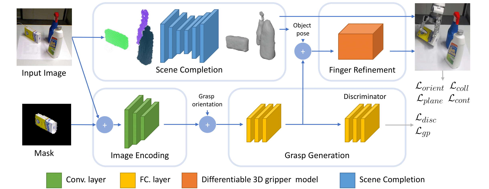

# DDGC

This repository includes code used in our work on [DDGC: Generative Deep Dexterous Grasping in Clutter](https://ieeexplore.ieee.org/stamp/stamp.jsp?tp=&arnumber=9483683). More specifically, it includes code to train a DDGC model.

**Authors**: Jens Lundell\
**Maintainer**: Jens Lundell, jens.lundell@aalto.fi  
**Affiliation**: Intelligent Robotics Lab, Aalto University

## Getting Started

The code was developed for python3.6 and Ubuntu 18.04.

### Dependencies

- Python requirements: Run `pip install -r requirements.txt`.
- [Barrett kinematics layer](https://github.com/aalto-intelligent-robotics/pytorch_barrett_hand_forward_kinematics_layer)

## Model



DDGC takes an RGB image of the complete scene and the mask of the object to grasp and predicts a multi-fingered robotic grasp on the target objects. Our architecture consists of three stages. First, the objects' shapes are completed. Next, grasps are generated on the target object by first feeding the RGB image and the mask through an image encoder, and based on the image encoding 6D multi-finger grasp poses and configurations are generated. Finally, the hand is refined to be close to the surface of the target object but not in collision with it by using our parameter-free fully differentiable [barrett kinematics layer](https://github.com/aalto-intelligent-robotics/pytorch_barrett_hand_forward_kinematics_layer).  

## Train

To train a DDGC model as in the paper you have to run the following (training data is pulled automatically)

```
python train.py 
```

Additional command line flags are found [here](options/base_options.py) and [here](options/train_options.py)

To visualize the training progress do

```
tensorboard --logdir checkpoints/ --samples_per_plugin=images=100
```

## Headless servers

If you want to run the code on a headless servers but have problems try the following:

```
export QT_API=pyqt
xvfb-run python train.py 
```

## Citation

If this code is useful in your research, please consider citing:

```
@article{lundellDDGCGenerativeDeep2021,
  title = {{{DDGC}}: {{Generative Deep Dexterous Grasping}} in {{Clutter}}},
  shorttitle = {{{DDGC}}},
  author = {Lundell, Jens and Verdoja, Francesco and Kyrki, Ville},
  year = {2021},
  month = oct,
  journal = {IEEE Robotics and Automation Letters},
  volume = {6},
  number = {4},
  pages = {6899--6906},
  issn = {2377-3766},
  doi = {10.1109/LRA.2021.3096239}
}
```

## License

This project is licensed under the MIT License - see the [LICENSE](LICENSE) file for details
